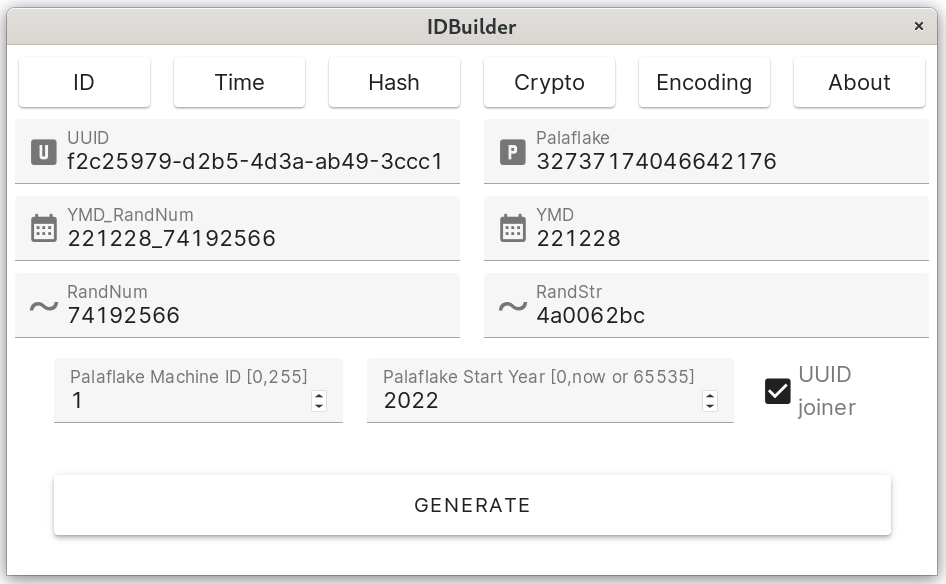

# IDBuilder

> 一个服务于Thaumy日常工作的小工具，用于规范化基础设施工作流。

## 涵盖功能（IDBuilder5）

### 标识

* UUID生成
* palaflake生成
* 字符串、数字的随机生成

### 时间

支持UTC时区调整的：

* 数据库格式的时间字符串生成
* 秒级及毫秒级时间戳生成

### 数字签名

* MD5、SHA1及SHA256

### 密码学

* 512～8192位RSA密钥对派生
* PKCS#1或PKCS#1 OAEP填充下的RSA加解密

### 编码

* 大小写互转换
* HEX互转换
* Base64互转换

## 注意事项

idb5-server:

* 需要.NET6运行时  
* 需要[WebSocketer](https://github.com/Thaumy/WebsSocketer)依赖  
* 需要[pilipala.util](https://github.com/Thaumy/pilipala-fs)依赖  
* 默认占用20222端口用作前后端通信

## 旧版本注意事项

* IDBuilder4
  * 出于跨平台和减轻重构复杂度的考量，该版本使用.NET5和Electron混合开发，故需要.NET5运行时。
  * 需要 WaterLibrary 1.1.7 - Yuki 依赖。如有缺失，请自行到我的相应repo中下载并编译。
* IDBuilder3
  * 使用UWP构建，由于Windows商店许可证等问题，需要在本地环境中编译后使用。
* IDBuilder1与IDBuilder2
  * 使用WPF构建，过时的版本，不建议使用。
